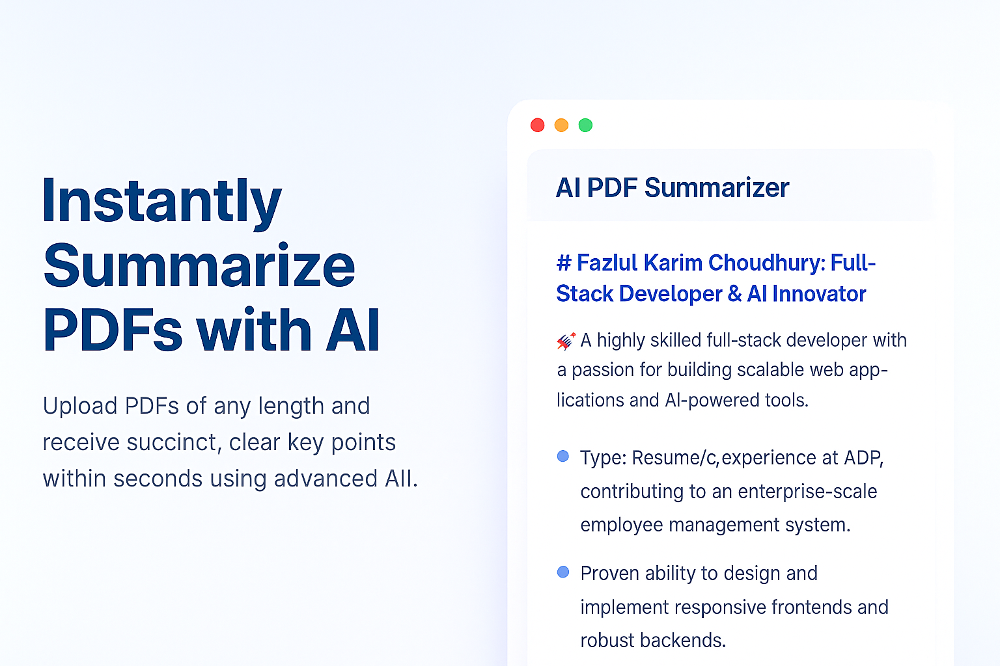

# PaperSight AI



**PaperSight AI** is an innovative web application designed to simplify the process of summarizing and managing PDF documents using advanced AI technology. Built with Next.js, PaperSight AI leverages the power of Google's Gemini AI model to provide concise summaries of uploaded PDFs, making it an invaluable tool for researchers, students, and professionals who need to quickly extract key information from lengthy documents.

## Table of Contents

- [Features](#features)
- [Technology Stack](#technology-stack)
- [Installation](#installation)
- [Usage](#usage)
- [Project Structure](#project-structure)
- [Contributing](#contributing)
- [License](#license)
- [Contact](#contact)

## Features

- **PDF Upload**: Easily upload PDF documents for summarization through a user-friendly interface.
- **AI-Powered Summaries**: Utilize Google's Gemini AI to generate detailed summaries of uploaded PDFs, including key points and insights.
- **Summary Management**: View, download, and delete summaries from a personalized dashboard.
- **Responsive Design**: Access PaperSight AI from any device with a responsive and intuitive UI.
- **Secure Storage**: Store and manage your documents and summaries securely.

## Technology Stack

- **Frontend**: Next.js, React, TypeScript, Tailwind CSS
- **Backend**: Next.js API Routes, UploadThing for file handling
- **AI Integration**: Google Gemini API for summarization
- **Database**: SQL database for storing summary metadata (schema defined in `schema.sql`)
- **Linting**: ESLint for code quality and consistency
- **Deployment**: Optimized for Vercel deployment

## Installation

To set up PaperSight AI locally, follow these steps:

### Prerequisites

- Node.js (version 18.x or higher)
- npm, yarn, pnpm, or bun package manager
- Git (optional, for cloning the repository)

### Steps

1. **Clone the Repository** (if applicable):
   ```bash
   git clone https://github.com/yourusername/papersight_ai.git
   cd papersight_ai
   ```

2. **Install Dependencies**:
   ```bash
   npm install
   # or
   yarn
   # or
   pnpm install
   # or
   bun install
   ```

3. **Environment Variables**:
   Create a `.env.local` file in the root directory and add the necessary environment variables. Refer to the `.env.example` file (if available) or the project documentation for required variables, such as API keys for Gemini AI and database connection strings.

   Example `.env.local`:
   ```
   NEXT_PUBLIC_GEMINI_API_KEY=your_api_key_here
   DATABASE_URL=your_database_connection_string_here
   UPLOADTHING_SECRET=your_uploadthing_secret_here
   ```

4. **Run the Development Server**:
   ```bash
   npm run dev
   # or
   yarn dev
   # or
   pnpm dev
   # or
   bun dev
   ```

5. **Access the Application**:
   Open [http://localhost:3000](http://localhost:3000) in your browser to see the application running. You can start exploring the features by uploading a PDF document.

## Usage

1. **Upload a PDF**:
   Navigate to the upload page (`/upload`) and use the dropzone to upload a PDF file. The system will process the file and generate a summary using Gemini AI.

2. **View Summaries**:
   Access your dashboard (`/dashboard`) to see a list of all processed summaries. Click on a summary to view detailed content (`/summary/[id]`).

3. **Manage Summaries**:
   From the dashboard or summary view, you can download summaries as text files or delete them if no longer needed.

4. **Explore the UI**:
   The application features a modern UI with components like navigation menus, cards, and alerts, ensuring a seamless user experience across devices.

## Project Structure

PaperSight AI follows a standard Next.js project structure with additional custom components and utilities:

- **`app/`**: Contains the main application routes and pages.
  - `page.tsx` (root): Home page with hero section.
  - `dashboard/page.tsx`: User dashboard for summary management.
  - `upload/page.tsx`: PDF upload interface.
  - `summary/[id]/page.tsx`: Detailed view of individual summaries.
- **`components/`**: Reusable UI components.
  - `ui/`: Custom UI elements like buttons, cards, and navigation menus.
  - `hero-section.tsx`: Promotional section on the homepage.
- **`actions/`**: Server-side logic for summarization.
  - `summarizePDF.ts`: Handles PDF processing and AI summarization.
- **`lib/`**: Utility functions and shared code.
  - `gemini.ts`: Integration with Google Gemini API.
  - `db.ts`: Database connection and queries.
- **`public/`**: Static assets like images and icons.
- **`utils/`**: Helper functions for file formatting and upload handling.

## Contributing

We welcome contributions to PaperSight AI! To contribute, please follow these guidelines:

1. **Fork the Repository**: Create your own fork of the codebase.
2. **Create a Branch**: Make your changes in a new branch with a descriptive name related to the feature or bug fix.
3. **Commit Changes**: Follow conventional commit messages (e.g., `feat: add user authentication`, `fix: resolve upload error`).
4. **Run Tests**: Ensure all tests pass (if applicable) and lint your code with `npm run lint`.
5. **Submit a Pull Request**: Open a PR with a detailed description of your changes and reference any related issues.

Please adhere to the project's code style and ensure your changes are well-documented. For major changes, open an issue first to discuss the proposed feature or bug fix.

## License

This project is licensed under the MIT License - see the [LICENSE](LICENSE) file for details. You are free to use, modify, and distribute this software as per the terms of the license.

## Contact

For questions, feedback, or support, please reach out to the project maintainers:

- **Email**: fazlul0127@gmail.com

Thank you for using PaperSight AI! We hope this tool enhances your productivity by making document summarization effortless and efficient.
